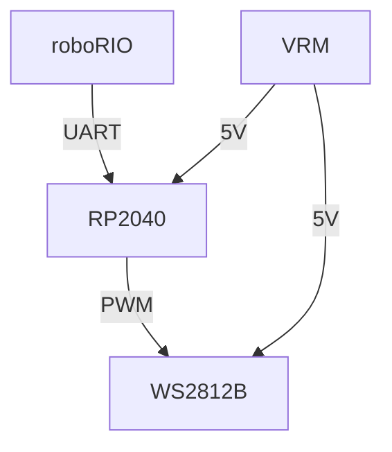

# Glow Worm

## Overview

**WIP: This Is Currently In Development!**

The goal of this project is to create a simple
interface for a roboRIO to drive a string of WS2812 LEDs.

The RP2040 will accept commands from the RIO, and from
there turn on a pre-configured set of LEDs.



## Build

- Install and setup [pico-sdk](https://github.com/raspberrypi/pico-sdk#getting-the-latest-sdk-code)
- Set the `PICO_SDK_PATH` to match, see `pico-sdk` repo above
- Create a build folder, run cmake, then run make

```sh
$ mkdir build
$ cd build
$ cmake ../
$ make
```

In the future, you can skip ahead to the `make` command when you have code changes.

Afterward, within the `build/src` folder, use the `.uf2` file for programming

## Programming The RP2040

- Hold the `BOOTSEL` button on the off RP2040
- Plug the RP2040 in to the computer via USB while holding `BOOTSEL`
- Release `BOOTSEL`
- After a moment, it will show up as a storage device.
- Copy the `.uf2` file to the storage device

The RP2040 will reboot, starting code

## TODO
- [ ] Verify 3.3v is enough to reach a logical high for WS2812
- [ ] Create control interface between RP2040 and RIO
- [ ] Create a list of patterns for the RP2040 to output

## Credits

Thanks to [MrYsLab's NeoPixelConnect](https://github.com/MrYsLab/NeoPixelConnect) library, which has been copied here with minor modifications to make it non-specific to Arduino.
