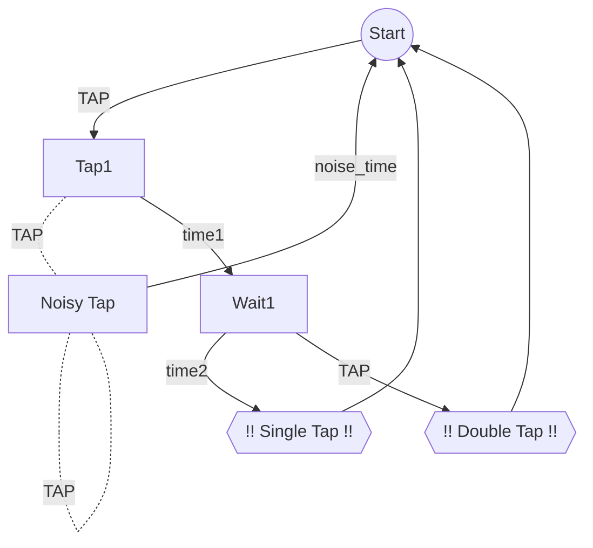

# Glow Worm

## Overview

**CONGRATULATIONS**

This project is the code running on the 2025 KoiBots award.
If you're holding one of these, **you rock!**. 

If you're just stopping by to read the code, **I'm Sorry. I hope I commented it well enough.**
Please, if you have any questions feel free to ask me! Don't assume this code is the best designed
or free of bugs. I'm only human! But I'm happy to explain anything I've done here.

### How To Use It

The award is "always on." As long as it has power, via USB or Battery, it will work.
Set the award on a solid surface.

- Double tap the top of the black base to turn on the LEDs.
  - You may have to tap faster than you think.
- Once the LEDs are on, single tap to change the pattern they display.
  - I've programmed in a KoiBots Orange/Purple effect, as well as a rainbow.
  - If you're able to follow the `Programming` guide, I'm happy to create custom patterns for you!
  - You can also reprogram the device to your heart's content!
- Double tap again to turn off the LEDs

Eventually the battery will run too low for the LEDs to power.
Just plug the device in over USB and it'll charge it back up.

### What It Is

The award is powered by a small circuit of the following components:
- [RP2040 PropMaker](https://www.adafruit.com/product/5768)
- [7x WS2812B "Skinny" LEDs](https://www.adafruit.com/product/2963)
- [2000 mAh LiPo battery](https://www.adafruit.com/product/2011)

All of the programming contained on the RP2040 is in this repo.
The LEDs are connected to the terminal block on the RP2040. 
Please see their datasheet for further guidance on pinouts and capabilities. It's a really awesome little board.

## Programming

### Build

- Install and setup [pico-sdk](https://github.com/raspberrypi/pico-sdk#getting-the-latest-sdk-code)
- Set the `PICO_SDK_PATH` to match, see `pico-sdk` repo above
- Create a build folder, run cmake, then run make

```sh
$ cmake -B build
$ cmake --build build
```

Afterward, within the `build/src` folder, use the file `glowworm.uf2` file for programming

### Programming The RP2040

The RP2040 must be put in to bootloader mode to re-program it. This can be done in one of two ways.
1. Physically pressing buttons down on the development board
2. Sending a command over USB to the application

Option 1 can be difficult without taking apart the award. However, both will be covered.

### By Buttons

The RP2040 board has two pushbuttons, labelled `Reset` and `Boot`.
- Plug in the USB-C cable to a computer.
- Hold both buttons down.
- After a few seconds, release the `Reset` button.
- After a few more seconds, release the `Boot` button.
- Continue to the `Copy File` section


### By USB

The application code is has a small bit of code to handle serial commands over USB.
Using a serial terminal (gtkterm, moserial, minicom, picocom, putty etc) you can interact with this terminal.
I recommend using one of those applications. In the absence of them, you can also `echo` the command over
on Linux or Mac. First you'll need to identify the serial port used by the device, then you can send over the command.

- Start with device not connected to the computer
- Check the list of attached serial devices (see below)
- Plug the device in to the computer, wait a moment.
- Check the list of devices again.

#### Checking for Serial Devices

**Linux**
```shell
$ ls /dev/tty*
```

(There will be a lot of options. Look for ttyACM and ttyUSB. On my machine, the devices comes up as ttyACM0)

**Mac**
```shell
$ ls /dev/cu.*
```

#### Reading back the terminal

(Replace ttyACM0 with the serial port found above)

```shell
$ cat /dev/ttyACM0

=========================
 GLOW-WORM Firmware r1.1 
=========================
 Commands:               
   P: Program board with 
      a new .UF2 file    
   R: Reboot the board   
```

#### Send the board to programming mode

(Replace ttyACM0 with the serial port found above)
(You may have to use `sudo` here depending on your machine configuration)

```shell
$ echo "p" > /dev/ttyACM0
```

The board should then reboot to bootloader mode, see the `Copy File` section below.

### Copy File

Once the board is booted up to its bootloader mode, it should show up on your computer as an external media.
Same as a flash drive.

All you need to do now to program and reboot the device is copy over a valid UF2 file. See the Releases section
of this project, or ask the developer if you need specific changes.

Once the file is copied over the device will program itself and reboot in to application mode.

### Other Notes

Following are just some notes I have on the coding for the device.

#### Accelerometer State Machine

The [LIS3DH](https://www.st.com/en/mems-and-sensors/lis3dh.html) ([Datasheet](https://www.st.com/resource/en/datasheet/lis3dh.pdf) , [AppNote](https://cdn-shop.adafruit.com/datasheets/LIS3DHappnote.pdf))
accelerometer has built-in tap detection. They advertise "Single And Double Tap" capabilities. Really, they should advertise "Single **or** Double Tap".
The device cannot be programmed to alert you when a Single Tap occurs, as well as when a Double Tap occurs.

Our fix for this is programming.

I've put together a small state machine that's advanced by timers and taps. I've tried to keep the design easy enough that
future me could debug it. Here's a small diagram showing the states and transition at the time of this writing.




- `Noisy Tap` is meant to prevent the device from turning on when it's being jostled around.
  - It works "OKAY." A better debounce mechanism could be put in.
  - That'd also make the code more complicated.
- `Wait1` used to also have a `Wait2` that it would feed to. 
  - It quickly felt redundant as we'd just inevitably fall in to the Double Tap state.
- The time values as of this writing are:
  - `time1: 100ms`
  - `time2: 200ms`
  - `noise_time: 100ms`
  - (so tap fast for double tap!)


## Credits

- Thanks to Steve Nystrom for the very fun project idea, and for designing and constructing the work itself.
- Thank you to the KoiBots for being an amazing bunch, this project is for you.
- Thanks to [MrYsLab's NeoPixelConnect](https://github.com/MrYsLab/NeoPixelConnect) library, which has been copied here with minor modifications to make it non-specific to Arduino.
